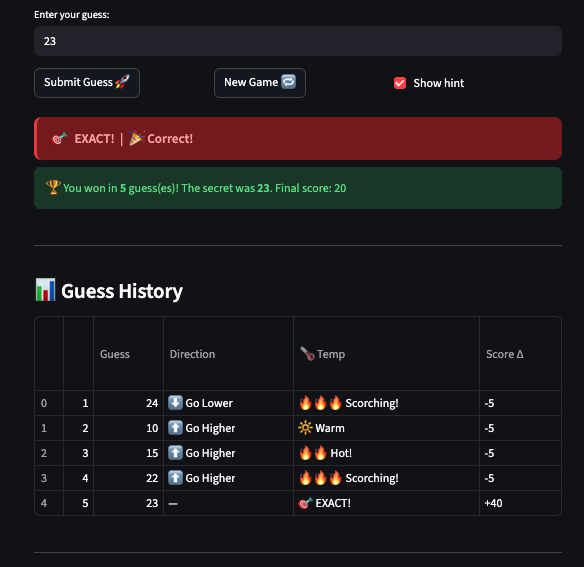

# 🎮 Game Glitch Investigator: The Impossible Guesser

## 🚨 The Situation

You asked an AI to build a simple "Number Guessing Game" using Streamlit.
It wrote the code, ran away, and now the game is unplayable. 

- You can't win.
- The hints lie to you.
- The secret number seems to have commitment issues.

## 🛠️ Setup

1. Install dependencies: `pip install -r requirements.txt`
2. Run the broken app: `python -m streamlit run app.py`

## 🕵️‍♂️ Your Mission

1. **Play the game.** Open the "Developer Debug Info" tab in the app to see the secret number. Try to win.
2. **Find the State Bug.** Why does the secret number change every time you click "Submit"? Ask ChatGPT: *"How do I keep a variable from resetting in Streamlit when I click a button?"*
3. **Fix the Logic.** The hints ("Higher/Lower") are wrong. Fix them.
4. **Refactor & Test.** - Move the logic into `logic_utils.py`.
   - Run `pytest` in your terminal.
   - Keep fixing until all tests pass!

## 📝 Document Your Experience

- [ ] Describe the game's purpose.
- [ ] Detail which bugs you found.
- [ ] Explain what fixes you applied.

## 📸 Demo

- [ ] [Insert a screenshot of your fixed, winning game here]

## 🚀 Stretch Features

### ✅ Challenge 4: Enhanced Game UI

The following UI enhancements were added to `app.py` **without modifying any core logic** in `logic_utils.py`:

#### 🌡️ Hot/Cold Temperature System
Each guess triggers a color-coded temperature rating based on proximity to the secret number:

| Distance from Secret | Emoji       | Label      | Color Theme |
|----------------------|-------------|------------|-------------|
| Exact match          | 🎯          | EXACT!     | 🔴 Red      |
| 1–3 away             | 🔥🔥🔥      | Scorching! | 🔴 Red      |
| 4–8 away             | 🔥🔥        | Hot!       | 🟠 Amber    |
| 9–15 away            | 🔆          | Warm       | 🟢 Green    |
| 16–25 away           | ❄️          | Cold       | 🔵 Blue     |
| 26+ away             | 🧊🧊        | Freezing!  | 🟣 Indigo   |

#### 📊 Live Stats Bar
A four-column metric strip always shows: attempts left, guesses made, current score, and active range.

#### 📋 Session Summary Table
A running table updates after each guess showing every guess, direction hint, temperature rating, and score delta for that turn.

